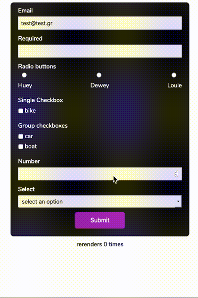

# light-react-validator

> Made with create-react-library

[](https://www.npmjs.com/package/light-react-validator) [](https://standardjs.com)  

**light-react-validator** is a validator very fast, very small, and with extra flexibility!

## General Idea
The validator follows the "prototypal inheritance" model for the configuration. The idea is simple: The closest to the element rules and messages override the previous. For example, builtin validators are overridden by user's global config validators (customValidators), which are overridden by element-specific validators. Same thing with error messages. Because **light-react-validator** hasn't any default error messages (yet), the element-specific error messages override the global config messages. Also **light-react-validator** re-renders only when is necessary, therefore is very fast!!

## Purpose

## Demo



## Install (not published yet)

```bash
npm install --save light-react-validator
```

## Basic Example

```tsx
import React from 'react'

import { useValidator } from 'light-react-validator'

const MyComponent = () => {
   const { track, submitForm, errors, formValidity } = useValidator()

   return (
      <label htmlFor='email'>Email</label>
          <input
            ref={(elem) =>
              track(elem, {
                rules: { required: true, email: true },
                messages: {
                  required: 'email is required',
                  email: 'is not an email'
                }
              })
            }
            name='email'
            onChange={(e) => console.log('original onChange ', e.target.value)}
            onFocus={(e) => console.log('original onfocus ', e.target.value)}
            type='text'
            id='email'
          />
          {errors?.email && showErrors(errors.email)}
   )
}
```
## Complex Example

```tsx
import React from 'react'

import { useValidator } from 'light-react-validator'
const config = {
      customValidators: {
        email: (input: string): boolean =>
          /^\w+([-]?\w+)*@\w+([-]?\w+)*(\.\w{1})+$/.test(input)
      },
      errorOnInvalidDefault: true,
      validateFormOnSubmit: true,
      globalMessages: { required: 'this input is required' },
      globalOptions: { minLength: 5}

    }
const MyComponent = () => {
   const { track, submitForm, errors, formValidity } = useValidator(config)

   return (
      <form id='form' onSubmit={(e) => submitForm(submit)(e)}>
        <div className='form-group'>
          <label htmlFor='email'>Email</label>
          <input
            ref={(elem) =>
              track(elem, {
                rules: { required: true, email: true, minLength: true },
                messages: {
                  required: 'email is required',
                  email: 'is not an email'
                },
                options: { minLength : 3 }
              })
            }
            name='email'
            onChange={(e) => console.log('original onChange ', e.target.value)}
            onFocus={(e) => console.log('original onfocus ', e.target.value)}
            type='text'
            id='email'
            defaultValue='test@test.gr'
          />
          {errors?.email && showErrors(errors.email)}
        </div>
         <button disabled={!formValidity} type='submit'>
            Submit
          </button>
        </form>
   )
}
```


## The **useValidator** hook
The useValidator accepts a config as described below and returns an object with the following properties:
| Property        | Description           | Type  |  Default
| ------------- |:-------------:| -----:| -------:|
| track     | this function initialize the "watcher" for this specific input. Basically it's a callback ref function | function | -
| submitForm (optional) | this function is a hof function (high order function).The first's function argument is a function which runs on form submit after successful validation and the second's functions argument is the event  |   function | -
| errors | An with errors if errors exist. The errors are separated by input's name on depth 0 and with validation rule on depth 1.  |   object | {}
| formValidity | the current validity  status  |   boolean | true


EXAMPLES HERE

## Options

### global config options (optional)

The **light-react-validator** hook accepts custom config with the following properties:
| Variable        | Description           | Type  |  Default
| ------------- |:-------------:| -----:| -------:|
| customValidators     | You can specify custom validators in order to override the builtIn validators | object | undefined
| validateFormOnSubmit      | validation starts on submit      |   boolean | false
| errorOnInvalidDefault |    if an input has default value on render, it shows the error immediately   |   boolean | false
| globalMessages      | global error messages      |   object | undefined
| globalOptions |    global options   |   object | undefined

 **All the above properties are optional**

 **custom config example**

 ```tsx
 const config = {
      customValidators: {
        emailWithSpecificDomain: (input: string, domain: string): boolean =>
          /^\w+([-]?\w+)*@\w+([-]?\w+)*(\.\w{2,3})+$/.test(input) && input.endsWith(domain)
      },
      errorOnInvalidDefault: true,
      validateFormOnSubmit: true,
      globalMessages: { required: 'this input is required', emailWithSpecificDomain: 'mail does not end with gr domain' },
      globalOptions: { minLength: 5, emailWithSpecificDomain: 'gr'}

    }
    ...
     const { track, submitForm, errors, formValidity } = useValidator(config)

     ...

      <input
            ref={(elem) =>
              track(elem, {
                rules: { required: true, emailWithSpecificDomain:true }
              })
            }
            name='email'
            type='text'
          />
 ```
 The above config overrides the builtIn email validator and enables errorOnInvalidDefault, validateFormOnSubmit. Also sets a global error message for the required rule in a case that an element has required rule but NOT a specific error message for this validator.
 Also sets minLength rule 5 which applies on all inputs with minLength rule but without input option specifically for this rule

 #### track example:

 ```tsx
  <input
            ref={(elem) =>
              track(elem, {
                rules: { required: true },
                messages: {
                  required: 'email is required'
                }
              })
            }
            name='email'
            type='text'
          />
 ```

 #### form submit example:

 ```tsx

 const submit = () => {
    // any code
  }

  <form id='form' onSubmit={(e) => submitForm(submit)(e)}>
    // any code
  </form>
 ```

 #### errors object example

 ```tsx
 errors:{
   email:{required:"email is required",email:"is not an email"},
   free:{required:"free is required"},
   drone:{required:"radio is required"},
   vehicle:{required:"checkbox is required"},
   groupCheckbox:{required:"checkbox is required",minCheckboxes:"you should check at least 2 checkboxes"},
   number:{required:"number is required"},
   select:{required:"select is required"}
   }
 ```

### Validator overrides

The light-react-validator has 3 types of validators:
* BuiltIn
* Global config
* Input-specific

 > **Input specific** validators overrides **Global config** validators and those overrides **BuiltIn** validators

 #### BuiltIn Validators
 1. required
 2. email
 3. minLength
 4. maxLength
 5. minCheckboxes

| BuiltIn        | Arguments    |
| ------------- |:-------------:|
| required     | value: T |
| email      | input: string      |
| minLength | input: string, len: number |
| maxLength | input: string, len: number |
| minCheckboxes | input: any, availableOptions: any  |


> In order to pass additional arguments to the validator, the arguments should be declared on options property. !important the validator and the extra arguments should have the same name!!

### Track input

In order to the validator watches the input should be passed the ref through the hook's track function.
Note: Each field is required to have a unique name as a key.

 ```tsx
   <input
            ref={(elem) =>
              track(elem, {
                rules: { required: true, email: true },
                messages: {
                  required: 'email is required',
                   email: 'is not an email'
                },
                customValidators: {
                  // custom validation rules
                },
                options: {
                  //options which passed in specific validators
                  // validators and options properties must have same name!
                }
              })
            }
            name='email'
            onChange={(e) => console.log('original onChange ', e.target.value)}
            onFocus={(e) => console.log('original onfocus ', e.target.value)}
            type='text'
            id='email'
            defaultValue='test@test.gr'
          />
  ```

## Contributing
You are welcome to contribute to this project, but before you do, please make sure you read the [contribution guide](https://github.com/thstamod/light-react-validator/blob/master/CONTRIBUTING.md).

## Acknowledgments
The initial idea came from [react-hook-form](https://github.com/react-hook-form/react-hook-form)

## License

MIT © [thstamod](https://github.com/thstamod)
